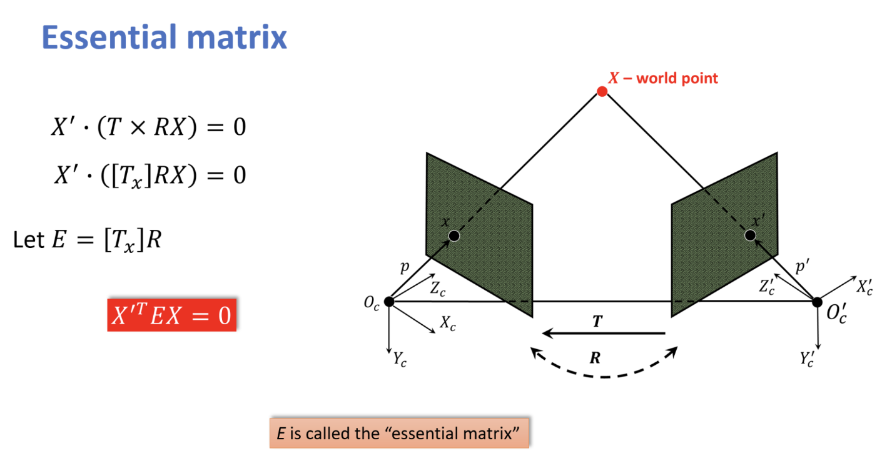

# Monocular Visual SLAM
SLAM is a technique used in robotics and computer vision to enable a device to build a map of an unknown environment while simultaneously determining its location within that map.

Monocular SLAM (which is built in this project), relies solely on a single camera, making it lightweight but challenging due to scale ambiguity and reliance on visual cues.

## Problem Statement
**Problem**: We have a video from a car’s dashcam → we want to draw a map of the surrounding environment (or at least the car’s moving trajectory). → we also want to localize the car within that map.

**Approach**: 

    - The video can be split into individual frames.
    - How do we get a map from these frames? → Look at how things move between frames.
    - How do we track movement? → Find keypoints (important spots) in each frame. → Match those keypoints across frames to see what moved where.
    - What do we do with matches? → Use the matches keypoints to estimate how the camera (car) moved. → Compute the camera’s rotation and position change (motion) using the matches.
    - How do we estimate motion → Calculate a matrix (like the essential matrix) that shows the camera’s shift. → Break it down into rotation and direction the car traveled.
    - What next for the map? → Use the motion and matched keypoints to find 3D locations of those points. → Triangulate by combining the camera’s positions to pinpoint where keypoints are in space.
    - Then what? → Build a 3D map from these points (a sparse cloud of landmarks). → Update the car’s position and the map with each new frame.

## Proposed Pipeline

```text
Pipeline: Twitch SLAM (Monocular SLAM Toy Implementation)

|__1. Input Acquisition and Preprocessing
|  |
|  |_1.1. Video Input 
|  |
|  |_1.2. Preprocessing 
|     |
|     |__1.2.1. Downscaling
|     |
|     |__1.2.2. Camera Calibration
|
|__2. Feature Detection and Matching
|  | 
|  |_2.1. Keypoint Detection
|  |
|  |_2.2. Feature Matching
|     |
|     |_2.2.1. Matching
|     |
|     |_2.2.2. Filtering
|
|__3. Camera Motion Estimation
|  |
|  |_3.1. Essential Matrix Computation
|  |
|  |_3.2. Pose Decomposition
|
|__4. Triangularation for 3D mapping
|  |
|  |_4.1. Projection Matrix formation
|  |
|  |_4.2. 3D Point Computation
|
|__5. Integration and Tracking
|  |
|  |_5.1. Pose Accumulation
|  |
|  |_5.2. Map Update
|
|__6. Visualization and Output
   |
   |_6.1. 2D Visualization
   |
   |_6.2. 3D Visualization
```
---
## Main Content

### 1. Input Acquisition and Preprocessing

- **Why It’s needed?** SLAM starts with raw sensory data  — here, a sequence of images from a monocular camera.  These images provide the visual information needed to detect landmarks and estimate motion. Preprocessing ensures the data is in a usable format (e.g., manageable resolution, grayscale for feature detection)
- **Method**:
    - Used OpenCV’s `cv2.VideoCapture` to read frames from a pre-recorded video file.
    - The script `main.py` accepts a video path and parse it into the functions inside `display.py` in order to process each frame, detect keypoints, match them, and then display them out.
    - Tried ORB, SIFT, and cv2.goodFeaturesToTrack for feature extraction.
    - Frames were downscaled to reduce computational load.

- **Experiments and Evaluations**:
    - **ORB (Oriented FAST and Rotated BRIEF)**:
        
        - **Observation**: The detected keypoints are spread out but seem to focus on strong edges, particularly around cars and lane markings.
        - **Strengths**:
            - Fast and efficient for real-time application.
            - Detects rotation-invariant keypoints.
            - Works well on high-contrast regions.
        - **Weaknesses**:
            - Not the best at detecting finer details.
            - Not scale-invariant (keypoints might change at different distances)

    - **SIFT (Scale-Invariant Feature Transform)**
        
        - **observation**: Keypoints appear to be **more distributed across the image**, especially in textured areas like trees and road signs.
        - **Strengths**:
            - Excellent at detecting **fine-grained details**.
            - Scale and rotation-invariant.
        
        - Best for **matching features across multiple frames**.
        - **Weaknesses**:
            - Computationally expensive as the observed output video is so slow. (not ideal for real-time application).

    - **goodFeaturesToTrack**:
        
        - **Observation**: The detected corners are **concentrated in high-contrast areas**, but a lot of weak or unnecessary points are detected when too many are allowed.
        - **Strengths**:
            - Fast and efficient for motion tracking.
            - Works well with optical flow algorithms. 
            - Tunable parameters for reducing false positives.
        - **Weaknesses**:
            - Not scale or rotation-invariant.
            - Can sometimes miss corners if parameters are not well-tuned.

    - **AKAZE (Accelerated-KAZE)**:
        
        - **Observation**: The detected keypoints are somewhat similar SUFT but with **faster computation time**.
        - **Strengths**:
            - Better keypoints detection.
            - Scale and rotation-invariant.
        - **Weaknesses**:
            - Slower than ORB.
            - Not as precise as SIFT.

---

### 2. Feature Detection and matching

This step extracts keypoints and descriptors from video frames and matches them across consecutive frames to track movement, a critical foundation for estimating camera motion in the SLAM pipeline.

**<ins>Detection</ins>**:

- **Implementation Methods**: Several feature detection algorithms are tested in `extractor/extractor.py`:
    - **AKAZE**: Chosen for its balance of speed and robustness. Uses `cv2.AKAZE_create()` to detect keypoints and compute binary descriptors.
    - **ORB**: Fast and lightweight, using `cv2.ORB_create()`—suitable for real-time but less robust to scale/rotation changes.
    - **SIFT**: Slower but highly robust (`cv2.SIFT_create()`), excels in varied lighting and perspectives.
    - **GoodFeaturesToTrack**: Detects strong corners (`cv2.goodFeaturesToTrack`)—simple but the output are not so ‘high-quality’, also lacks descriptors.
    
- **Current Choice:** **AKAZE is selected** for its efficiency and binary descriptors, aligning with real-time SLAM needs while handling dashcam noise (e.g., blur, lighting shifts).

- **AKAZE Details**:
    - Generates **binary descriptors** — strings of bits (0s and 1s).
    - Example: A descriptor might look like `101010...` (256 or 486 bits, depending on settings).
    - **Why binary?** Fast to compare (using Hamming distance) and memory-efficient.

- **Problem 1**: AKAZE failed to detect features in less textured regions like roads, paint strips, etc,. Making it hard to deliver high quality characteristics and uniform quantity and distribution over frames.

<figure>
    
    <figcaption>AKAZE fails to capture the features in low-texture regions, also the number of detected features is limited in higher region.</figcaption>
</figure>

<p>

- **Solution**: Combine AKAZE with another detector such as ORB that also produces binary descriptors to supplement.
    - **AKAZE**: For high-quality features in textured regions.
    - **ORB**: For additional features in less textured areas.

- **Problem 2**: ORB and AKAZE combination successfully to detect much more keypoints, but still fails to capture keypoints in regions like road, lane-markings, curbs, etc,.

- **Solution**: 
    - Enhance Road Features with Preprocessing (e.g., `cv2.Canny` for edge detection) to highlight road lines and boundaries.
    - Supplement with Road-specific detectors (e.g., `cv2.goodFeaturesToTrack`) to capture corners and edges in low-texture areas.
-> By combining these detectors, the function aims to improve the number and quality of matches between consecutive frames in a dashcam video.

**<ins>Matching:</ins>**

- **Goal**: Match keypoints between frames to find correspondences (e.g., “This corner in frame 1 is here in frame 2”), enabling motion estimation.
- **Approach1**: Using OpenCV’s **Brute-Force Matcher** (`cv2.BFMatcher`) with `NORM_HAMMING` for AKAZE’s binary descriptors:
    - **What is `BFMatcher`?**
        - A brute-force matcher: Exhaustively checks all possible pairs of descriptors between two frames to find the most similar ones based on a distance metric.
        - **Distance Metric**: Hamming Distance, specifically designed for binary data.
    - **Hamming Distance**:
        - Measures the number of positions where two binary strings differ.
        - Example:
            - Descriptor 1: `1010`.
            - Descriptor 2: `1001`.
            - Hamming Distance = 2 (differs at positions 3 and 4).
        - Why using it? Because it’s efficient for binary descriptors (like AKAZE’s), counting bit mismatches directly.
    - **1-NN Matching (`match()`):**
        - Finds the nearest neighbor (smallest Hamming distance) for each descriptor in frame 1 from frame 2.
        - Parameter `crossCheck = True` ensures mutual best matches — e.g., point A matches B, and B matches A back — reducing false positives.
        - Simple and fast, but potentially give incorrect results due to affection of factors such as noise, light-quality, similar objects, etc,.
    - **K-NN Matching (`knnMatch` );**
        - Returns the top k nearest neighbors per descriptor.
        - Applies **Lowe’s ratio test**: `ratio = best_distance / second_best_distance < 0.75` keeps only distinctive matches (e.g., best is much closer than second-best).
        - Filters out ambiguous matches in noisy data (e.g., repetitive road lines or occluded objects).

- **Approach 2**: Since Brute-Force Matching can be slow due to exhaustive search, we can leverage methods like FLANN (Fast Library for Approximate Nearest Neighbors) to approximate nearest neighbor.
    - **FLANN**: A library for fast nearest neighbor search in high-dimensional spaces.
    - **Mechanism**: It builds an index of descriptors (e.g., using LSH for binary descriptors) and searches for matches efficiently. For binary descriptors, it uses Hamming distance and parameters like `table_number=6` and `key_size=12` to optimize speed and accuracy.
    - **Implementation**: 
        - `cv2.FlannBasedMatcher` is used with parameters for AKAZE descriptors.
        - Matches are filtered using Lowe’s ratio test.

- **Reducing Outliers in Matches**:
    - **RANSAC (Random Sample Consensus)**: A robust method to estimate parameters of a mathematical model from a set of observed data containing outliers.
        - **Mechanism**: It iteratively samples a minimal subset of matches (e.g., 8 matches to compute the fundamental matrix), builds a model, and counts how many other matches (inliers) fit this model within a threshold (e.g., reprojection error < 3.0 pixels). The model with the most inliers is selected, and outliers are discarded. 

    - **Lowe's ratio test**: 
        - **Purpose**: Descriptor matching can produce ambiguous matches, especially in repetitive regions like trees or sky. Lowe’s ratio test filters out unreliable matches by ensuring the best match is significantly better than the second-best.
        - **Mechanism**: For each keypoint, the matcher finds the two nearest descriptors in the other frame (using Hamming distance for binary descriptors like AKAZE/ORB). A match is kept if the distance to the closest descriptor is less than 0.65 times the distance to the second closest, indicating high confidence.
        - **Example**: A keypoint’s closest match has a Hamming distance of 30, and the second closest is 50. Since 30 < 0.65 * 50 (32.5), the match is kept; otherwise, it’s discarded as ambiguous.

<figure>
    
    <figcaption>The final matching result after combining AKAZE, ORB, and goodFeaturesToTrack. The quality and quantity of features and matches are way better than previously.</figcaption>
</figure>

<p>

**<ins>Pipeline Overview</ins>**:
The `extract_akaze_orb_features` function in `extractor.py` follows these steps:

1. **Preprocessing**: Enhance road features in both frames using `preprocess_image` (CLAHE → Gaussian blur → Canny edges → blend with original image) to make lane markings and road textures more prominent.

2. **Feature Extraction**:
- Detect AKAZE keypoints and descriptors with a threshold of 0.0001 to capture detailed features.
- Detect ORB keypoints and descriptors, limiting to 1500 features for efficiency.
- Use `goodFeaturesToTrack` to detect road-specific corners (e.g., lane markings, curbs), computing ORB descriptors for these keypoints.

3. `Keypoint Combination`: Concatenate AKAZE, ORB, and road keypoints into a single list per frame for unified processing.

4. **Feature Matching**:
- Match AKAZE, ORB, and road descriptors separately using FLANN (k=2 nearest neighbors) for speed.
- Apply Lowe’s ratio test (threshold 0.65) to filter unreliable matches.
- Adjust match indices to account for the combined keypoint lists.

5. **Outlier Filtering**: Use RANSAC to compute the fundamental matrix and filter outlier matches, ensuring geometric consistency.

6. **Return**: Output keypoints and good matches for further SLAM processing, such as motion estimation.

---
### 3. Camera Motion Estimation

**🚗 <ins>My Approach</ins>**:

Imagine your camera on a car taking pictures while driving on a highway. We want to figure out how the camera moves between two pictures -- did it go forward or turn? This is called **camera motion estimation**.

To do this, we use the matching points from the previous step, and a special camera "cheat sheet' called the **intrinsic matrix (K)** to solve this puzzle and find the camera's **rotation** (how it turned) and **translation** (how it moved).

- Inputs:
    - `matches`: The good matches between two frames.
    - `Intrinsic matrix`: The camera's internal settings, like focal length and optical center.

- Outputs:
    - `R`: The rotation matrix, showing how the camera turned.
    - `t`: The translation vector, showing how the camera moved.

```text
Matches (pixel coordinates)
--------------------------------------------------
pts1:                pts2:                # pts1, pts2: lists containing corresponding keypoints
[ (x_1, y_1)_1 ]     [ (x_2, y_2)_1 ]     # in two consecutive frames (pixel coordinates)
[ (x_1, y_1)_2 ]     [ (x_2, y_2)_2 ]     # e.g., (x_1, y_1)_1 corresponds to (x_2, y_2)_1
[     ...      ]     [     ...      ]     # Extracted from good_matches using kp1[m.queryIdx].pt and kp2[m.trainIdx].pt
[ (x_1, y_1)_n ]     [ (x_2, y_2)_n ]
--------------------------------------------------
          |
          |
          | Use K to convert x = [x, y, 1]^T to x̂ = K^(-1) * x
          | # x = [x, y, 1]^T: Homogeneous pixel coordinates of a point
          | # x̂: Normalized camera coordinates (after applying K^(-1))
          |
          |
          v
Matches (normalized camera coordinates)
--------------------------------------------------
x̂_1:                 x̂_2:                 # x̂_1, x̂_2: Corresponding points in normalized coordinates
[ x̂_1_1 ]            [ x̂_2_1 ]            # x̂_1_i = K^(-1) * [x_1_i, y_1_i, 1]^T
[ x̂_1_2 ]            [ x̂_2_2 ]            # x̂_2_i = K^(-1) * [x_2_i, y_2_i, 1]^T
[  ...  ]            [  ...  ]
[ x̂_1_n ]            [ x̂_2_n ]
--------------------------------------------------
          |
          |
          |
          | Compute based on x̂_2^T * E * x̂_1 = 0
          | # Uses the 5-point algorithm with RANSAC
          |
          |
          v
Essential Matrix E
--------------------------------------------------
# E: 3x3 matrix encoding relative rotation and translation
# Satisfies the epipolar constraint: x̂_2^T * E * x̂_1 = 0
--------------------------------------------------
```

**🧮 <ins>Two Important Kinds of Matrices</ins>**:
- **Fundamental Matrix (F)**:
    - Use this when you **don't know the camera's internal details** (like lens size, sensor size, etc,.).
    - It tells you how points in one image relate to lines in the other.
    Think of it as saying: "If this dot is here in the first image, then in the second image, it must be **somewhere along this line**.
    But it doesn't tell you **how far** something is in real life.

- **Essential Matrix (E)**:
    - Use this when you **know the camera's internal details** (called **intrinsics**).
    - It gives you much more powerful info: you can actually get the **rotation** and **translation** of the camera (i.e., how it moved and turned).
    - This lets you start building a 3D model from your 2D images.

So it's like:
- Fundamental Matrix = "Hey, you moved, but I don't know how bug your camera lens is."
- Essential Matrix = "Ah, I know how your camera works! Now I can really figure our how you moved".



**📷 <ins>What does a Calibrated Camera mean</ins>**:

Imagine wearing glasses 📐. If you know the exact specs of your glasses (like lens strength, thickness), then you can correct your view and say exactly how far away things are.
A **calibrated camera** is like a camera that has been measured very carefully—you know exactly:
- The size of the sensor
- The zoom level (focal length)
- Where the center of the image is

This info lets you turn **pixel positions** into **real-world info**.

So, in summary:
- **Calibrated Camera**: We know K (the camera’s settings, like its lens zoom and center point).
    - **Pros**: We can find the exact movement (rotation and translation).
    - **Cons**: We need K, which requires extra work to get.
- **Un-Calibrated Camera**: We don’t know K.
    - **Pros**: Easier to start since we don’t need K.
    - **Cons**: We can’t get the exact movement, just a rough idea.

**⚖️  <ins>Estimating the Camera's Intrinsic Matrix</ins>**:

To estimate the camera's `intrinsic matrix` (`K`) for our visual SLAM project, we need two approaches: 
1. chessboard calibration,
2. scene geometry. 

Since we’re using a dash-cam video from the internet, we can’t access the physical camera for chessboard calibration. Instead, we use the scene geometry approach, which is less accurate than chessboard calibration but sufficient for our needs.

The scene geometry approach exploits:

1. `Straight lane lines` and `road edges` in highway footage, providing perspective cues.
2. `Vanishing points`, where parallel lines (e.g., lane markings) converge, helping infer the focal length and principal point.

The relationship between vanishing points and the intrinsic matrix can be expressed as: $v_i^{\top}Tw_j = 0$ (for orthogonal vanishing points)

where $v_i, v_j$ are the vanishing points, and $w = (KK^T)^{-1}$ is the image of the absolute conic.

Solving this above function, we can obtain K

To construct `K`, we need:

1. `Focal length` (fx, fy): Determines the camera’s field of view.
2. `Principal point` (cx, cy): The optical center of the image.

The focal length calculation requires:

1. Vanishing points from sampled frames (at least 2 per frame).
2. The frame’s principal point.

So the final pipeline to compute the intrinsic matrix is as follows:

1. Sample a few random frames from the video (e.g., 10 frames, can be non-consecutive).
2. Convert each frame to grayscale.
3. Reduce noise using Gaussian blur.
4. Detect edges using Canny edge detection.
5. Detect lines using Hough Transform (cv2.HoughLinesP).
6. Cluster lines into two groups per frame (near-vertical and near-horizontal) using a slope threshold of 45 degrees to ensure at least 2 vanishing points.
7. Find vanishing points for each group by calculating line intersections, then average across all frames to get two final vanishing points.
8. Assume the principal point is at the frame’s center (width/2, height/2).
9. Calculate the focal length (fx = fy) using the vanishing points and principal point with the orthogonality constraint.
10. Construct K as [[fx, 0, cx], [0, fy, cy], [0, 0, 1]].

**🧠 <ins>How We Derive the Essential Matrix</ins>**:
- **What we have**:
    1. **Matches**:
        - `kp1`, `kp2`: Lists of keypoints from two consecutive frames (e.g., 6200–7000 keypoints per frame).
        - `good_matches`: A list of matches (e.g., ~780 matches after RANSAC), where each match is a `cv2.DMatch` object linking a keypoint in `kp1` to a keypoint in `kp2`. Each match provides a pair of corresponding 2D points in pixel coordinates (e.g., (x1, y1) in frame 1 and (x2, y2) in frame 2).
    2. **Intrinsic Matrix (K)**:
        - A $3 \times 3$ matrix [!matrix](images/k.png), where $fx, fy$ are the focal lengths in pixels, and $(cx, cy)$ is the principal point (image center). This matrix relates pixel coordinates to normalized camera coordinates.
- **Goal: Compute the Essential Matrix (E)**:

The essential matrix E is a 3x3 matrix that encodes the relative pose (rotation R and translation t) between two camera views, assuming the cameras are calibrated (i.e., we know K). It relates corresponding points in normalized camera coordinates and satisfies the epipolar constraint: $\mathbf{x}_2^TE\mathbf{x}_1 = 0 $
where $\mathbf{x}_1$ and $\mathbf{x}_2$ are the `normalized coordinates` of corresponding points in the two frames.
- **Approach to Compute the Essential Matrix**:
To compute E, we need to:
    1. **Extract Corresponding Points**:
        - From `good_matches`, extract the 2D pixel coordinates of matches points: $(x_1, y_1)$ from `kp1[m.queryIdx].pt` and $(x_2, y_2)$ from `kp2[m.trainIdx].pt` for each match `m`.
        - This gives us two arrays: pts1 (points in frame 1) and pts2 (points in frame 2), both in pixel coordinates.
    2. **Convert Pixel Coordinates to Normalized Camera Coordinates**:
        - The essential matrix operates on normalized camera coordinates, not pixel coordinates.
        - Use K to convert pixel coordinates $\mathbf{x} = [x, y, 1]^T$ to normalized coordinates $\mathbf{\hat{x}} = K^{-1}\mathbf{x}$.
        - Specifically, for a point $(x, y)$:  
        

    3. **Compute the Essential Matrix**:
        - Use the normalized coordinates to compute E. The standard method is the `5-point algorithm`, which requires at least 5 pairs of corresponding points to estimate E (though more points improve robustness).
        - Since we have noise in the matches (e.g., outliers), we combine the 5-point algorithm with `RANSAC` to filter out incorrect matches and estimate a robust E.
        - The 5-point algorithm minimizes the epipolar constraint while ensuring E has the correct structure (rank 2 with two equal non-zero singular values).
    4. **Decompose E into Rotation and Translation**:
        - Once we have E, we can decompose it into the relative rotation R (a 3x3 rotation matrix) and translation t (a 3x1 unit vector) between the two frames.
        - The decomposition yields four possible solutions for (R, t), but we can disambiguate them by checking which solution places the 3D points in front of both cameras (positive depth).
