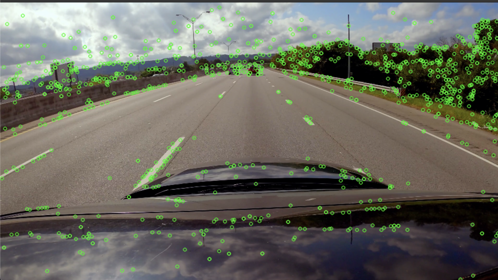

# Monocular Visual SLAM
SLAM is a technique used in robotics and computer vision to enable a device to build a map of an unknown environment while simultaneously determining its location within that map.

Monocular SLAM (which is built in this project), relies solely on a single camera, making it lightweight but challenging due to scale ambiguity and reliance on visual cues.

## Problem Statement
**Problem**: We have a video from a car’s dashcam → we want to draw a map of the surrounding environment (or at least the car’s moving trajectory). → we also want to localize the car within that map.

**Approach**: 

    - The video can be split into individual frames.
    - How do we get a map from these frames? → Look at how things move between frames.
    - How do we track movement? → Find keypoints (important spots) in each frame. → Match those keypoints across frames to see what moved where.
    - What do we do with matches? → Use the matches keypoints to estimate how the camera (car) moved. → Compute the camera’s rotation and position change (motion) using the matches.
    - How do we estimate motion → Calculate a matrix (like the essential matrix) that shows the camera’s shift. → Break it down into rotation and direction the car traveled.
    - What next for the map? → Use the motion and matched keypoints to find 3D locations of those points. → Triangulate by combining the camera’s positions to pinpoint where keypoints are in space.
    - Then what? → Build a 3D map from these points (a sparse cloud of landmarks). → Update the car’s position and the map with each new frame.

## Proposed Pipeline

```text
Pipeline: Twitch SLAM (Monocular SLAM Toy Implementation)

|__1. Input Acquisition and Preprocessing
|  |
|  |_1.1. Video Input 
|  |
|  |_1.2. Preprocessing 
|     |
|     |__1.2.1. Downscaling
|     |
|     |__1.2.2. Camera Calibration
|
|__2. Feature Detection and Matching
|  | 
|  |_2.1. Keypoint Detection
|  |
|  |_2.2. Feature Matching
|     |
|     |_2.2.1. Matching
|     |
|     |_2.2.2. Filtering
|
|__3. Camera Motion Estimation
|  |
|  |_3.1. Essential Matrix Computation
|  |
|  |_3.2. Pose Decomposition
|
|__4. Triangularation for 3D mapping
|  |
|  |_4.1. Projection Matrix formation
|  |
|  |_4.2. 3D Point Computation
|
|__5. Integration and Tracking
|  |
|  |_5.1. Pose Accumulation
|  |
|  |_5.2. Map Update
|
|__6. Visualization and Output
   |
   |_6.1. 2D Visualization
   |
   |_6.2. 3D Visualization
```
---
## Main Content

### 1. Input Acquisition and Preprocessing

    - **Why It’s needed?** SLAM starts with raw sensory data  — here, a sequence of images from a monocular camera.  These images provide the visual information needed to detect landmarks and estimate motion. Preprocessing ensures the data is in a usable format (e.g., manageable resolution, grayscale for feature detection)
    - **Method**:
        - Used OpenCV’s `cv2.VideoCapture` to read frames from a pre-recorded video file.
        - The script `main.py` accepts a video path and parse it into the functions inside `display.py` in order to process each frame, detect keypoints, match them, and then display them out.
        - Tried ORB, SIFT, and cv2.goodFeaturesToTrack for feature extraction.
        - Frames were downscaled to reduce computational load.
    - **Experiments and Evaluations**:
        - **ORB (Oriented FAST and Rotated BRIEF)**:
            ![ORB Feature Detection][images/ORB.png]
            - **Observation**: The detected keypoints are spread out but seem to focus on strong edges, particularly around cars and lane markings.
            - **Strengths**:
                - Fast and efficient for real-time application.
                - Detects rotation-invariant keypoints.
                - Works well on high-contrast regions.
            - **Weaknesses**:
                - Not the best at detecting finer details.
                - Not scale-invariant (keypoints might change at different distances)

        - **SIFT (Scale-Invariant Feature Transform)**
            
            - **observation**: Keypoints appear to be **more distributed across the image**, especially in textured areas like trees and road signs.
            - **Strengths**:
                - Excellent at detecting **fine-grained details**.
                - Scale and rotation-invariant.
                - Best for **matching features across multiple frames**.
            - **Weaknesses**:
                - Computationally expensive as the observed output video is so slow. (not ideal for real-time application).

        - **goodFeaturesToTrack**:
            
            - **Observation**: The detected corners are **concentrated in high-contrast areas**, but a lot of weak or unnecessary points are detected when too many are allowed.
            - **Strengths**:
                - Fast and efficient for motion tracking.
                - Works well with optical flow algorithms. 
                - Tunable parameters for reducing false positives.
            - **Weaknesses**:
                - Not scale or rotation-invariant.
                - Can sometimes miss corners if parameters are not well-tuned.
